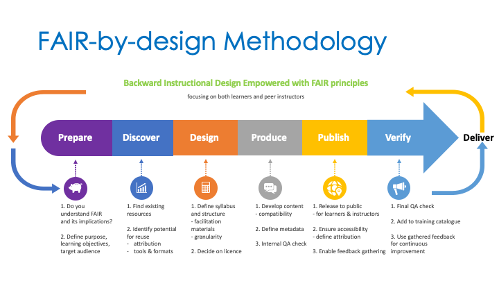

[_metadata_:author]:- "Skills4EOSC T2.3"
[_metadata_:title]:- "Welcome"
[_metadata_:tags]:- "FAIR-by-Design learning materials, FAIR learning objects, welcome"

# Welcome

## Introduction

## Learning Objectives
- Describe the FAIR-by-design methodology
- Identify FAIR design challenges

## Target Audience
- attendees of the FAIR-by-Design ToT live webinar

## Duration
- 10 mins

## Prerequisites
- familiarity with the published D2.2 FAIR-by-Design Learning Materials Methodology

## Learning Tools
- training BBB room
- Menti

## Participants

The training is focused on all Skills4EOSC project members that will need to develop learning materials for the different types of trainings envisaged within the project. No previous knowledge of FAIR materials development is required to follow the training. 
The training will be delivered by a set of trainers each focusing on different aspects of the FAIR-by-design methodology for development of FAIR learning materials. In addition, there will be moderators to help out with the technical aspects and fascilitators for any group activities. 

## Housekeeping

Participants can jump in during the training with a comment or question at any time using the provided chat or by opening their mics. Sharing personal experiences and recommending other tools and resources in addition to the examples provided during the training is strongly encouraged.
The focus of the training is on hands-on practical implementation of the FAIR-by-design methodology.
Thus there will be many activities that the participants will need to take active role in, aiming to test out the concepts and get a first hand experience.
There will be short 15 mins coffee breaks after each hour-hour and a half of traininig. During the second full day of training, there will be an 1 hour break for lunch.
Your feedback on this training is essential to improve it and provide you with additional examples and resources you might need during the FAIR learning materials development. Focusing on the co-creation process, in additon to the feedback form that is available on the course, there are many other ways to provide your feedback that will be presented during the training.

### Main interaction

The main interaction with the participants will be via mics, chat, BBB quiz and Menti questions.

## Training purpose

The main goal of the training is the practical implementation of the FAIR-by-Design learning materials methodology that has been developed by T2.3 and published in D2.2.
The methodology extends the backward instructional design process with the FAIR principles aiming to ensure that the learning materials will be findable, accessible, interoperable and resusable from their conception and throughout their lifetime including updates, new versions, reuse, etc. 

The methodology is composed of 6 main steps that are iteratively repeated within a continous improvement loop:
- Prepare
    - develop FAIR skills that will augment the traditional instructional design skills. These include FAIR principles, Intelectual Property Rights, licensing, attribution, permanent identifiers (PIDs) and metadata. 
    - define the purpose, learning objectives and audience targets
- Discover
    - identify existing learning materials
    - assess the potential for their reuse
- Design
    - define the syllabus and create the learning materials structure
    - start a fascilitators guide 
    - ensure interoperability by choosing open licences
- Produce
    - use open authoring tools and formats
    - develop accessible content
    - define metadata
- Publish
    - deposit the learning content for learners and for instructors
    - use PIDs
    - define access rights and provide attribution guidelines
    - enable feedback gathering
    - list in relevant catalogues
- Verify
    - go through a quality assurance (QA) process to verify FAIRness
Continuous improvement should be implemented to ensure the learning materials are up-to-date and gathered internal and external input has been incorporated. This includes: 
    - analyse gathered feedback
    - initiate a new version development when necessary

## Training objectives
Upon successfully completing the training the atendees should be able to:
- Define FAIR learning objects
- Adapt and mix FAIR learning objects
- Identify licenses and attribute correspondingly
- Structure comprehensive learning materials
- Manage file formats and tools
- Define metadata using a schema
- Create and publish FAIR-by-Design learning materials
- Collaborate with other instructors
- Assess FAIR-ness of existing learning objects 

## Materials
The final formats of all materials are avaialable on the Skill4EOSC learning platform within the FAIR-by-Design course. These include:
- presentation slides 
- presentation notes
- related templates
- links for further reading
- self-assessment quizes

The course also includes the BBB room used for the training that will have the recordings from the training. 

In addition there is also an open forum where any enrolled trainee can ask a question or start a discussion.

Finally, there is a feedback form that trainees are asked to fill out after the training so that the learning materials can be improved based on their feedback.

During the life training the materials will be revealed on a day-by-day basis as the training progresses. 

To access the materials one must register on the learning platform and then self-enroll in the course. 

The course also offers the possibility to obtain a FAIR Instructor badge once all course activities have been successfuly completed.

errrrorrrr

## Training outline

### Related Learning Materials

Refer to excersizes, quizes, games or other types of learning materials whereever they should be included in the unit and provide links to this content.

## Summary

At the end provide a short summary of the main points of the learning unit (these are the key takeaways that help reflect on the learning outcomes)

## Suggested Reading
- provide a list of references for further reading that should help clarify the content of the learning unit and elevate the knowledge level
- Skills4EOSC D2.2

