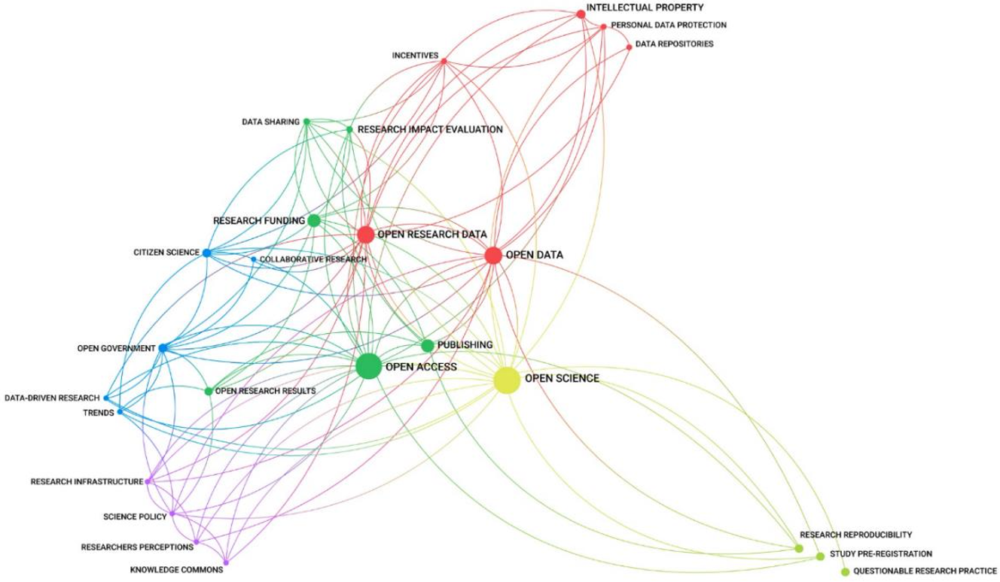
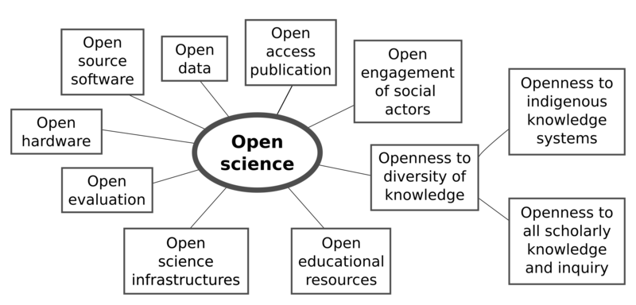

# Conceptualisation

Once the discovery stage is completed, you enter the third step of the backward instructional process. In this step the instructional designer needs to define the content concept map of the learning materials defining the sections, modules, units and learning objects it is going to contain. Once the learning materials syllabus is completed, the design continues by creating a blueprint of the complete structure of the learning materials, including additional documents that serve as an instructor facilitator kit promoting reuse by enabling others fully understand the learning content and its delivery.

## Learning Objectives
- Composing a content concept map
- Preparing a syllabus

## Target Audience
- attendees of the FAIR-by-Design ToT live webinar

## Duration
30 mins

## Prerequisites
completed [Prepare](../../Stage%201:%20Prepare/) stage of the FAIR-by-Design methodology training

## Learning Tools
- Training BBB room
- Browser
- Menti access or BBB quiz interaction

## Content concept map

Concept mapping is a tool for visualising interrelationships between concepts in an integrated, hierarchical manner. Using concept maps helps clarify the relationships among learning concepts when designing or redesigning your learning materials. The main goal of the concept map is to start outlining the specific components of your training, organize the components and make sure that they fit in with the defined learning objectives.

It does not matter which type of concept map you will use (hierarchical, spider, flowchart, etc.), the main focus here is to flesh out the components that you would like to include in your materials. 

An example concept map for Open Science is presented in the image below.

[Open Science concept map based on a keyword co-occurrence network analysis](https://www.researchgate.net/publication/343663327_The_Uptake_of_Open_Science_Mapping_the_Results_of_a_Systematic_Literature_Review/figures?lo=2) in the [The Uptake of Open Science: Mapping the Results of a Systematic Literature Review](http://dx.doi.org/10.1051/itmconf/20203301001) by Hanna Shmagun, Charles Oppenheim, Jangsup Shim and Jaesoo Kim available under [CC BY license](http://creativecommons.org/licenses/by/)

### Activity

Try building a concept map about your upcoming training. You can start with the most simple approach. Use the topic of the training as a core concept in the middle, and then just link the concepts you think are important to cover to it. With this you will get a star shaped concept map design, also known as the spider concept map. You can continue adding layers to the concept map by defining subconcepts of the defined concepts. 

Sometimes it is best if you do this exercise on a piece of paper as the process will follow your design thinking more naturally. If you want to work on a digital concept map you can use almost any tool for graphical modelling. An example is [draw.io](http://draw.io/) that offers several templates with different concepts maps design (you will find them in the category Maps when choosing to create a new diagram from template).

Your final result may look simple or complicated. This depends on the focus of the training, the length of the training and the level of details that you want to represent.

Another example is presented below.

[Open science elements based on UNESCO presentation of 17 February 2021](https://commons.wikimedia.org/wiki/File:Osc2021-unesco-open-science-no-gray.png) by [RobbieIanMorrison](https://commons.wikimedia.org/wiki/User:RobbieIanMorrison) provided under the [CC BY 4.0 license](https://creativecommons.org/licenses/by/4.0/deed.en)

## Syllabus 

Once you have identified your learning concepts, the next step is to sequence them into an instructional sequence (agenda). This instructional sequence will become your blueprint for the organisation of the learning materials and the definition of the syllabus.

In essence the blueprint takes the input from the creative concept map and organizes it into a more formal outline. Formally, we call this learning materials outline syllabus. Each syllabus should provide information regarding a number of elements (including the ones defined in the step 1 of the backward instructional design):

- clear, descriptive title 
- description of the purpose or goal 
- target audience
- prerequisites
- duration
- learning objectives
- agenda (instructional sequence)
- resources and materials
- certification information

Remember that:

- The syllabus can present a higher level sequence outline, that can be later broken down into smaller subtopics if necessary.
- The topics sequence should be defined so that the concepts introduced early help with the ones encountered later. 
- The defined agenda should not be very rigid thus preventing changing the sequence of topics or adding or deleting topics at a later stage.
- The syllabus is sent to the learners and should provide them with all necessary information to help them decide if they want to follow the training related to the learning materials.

### Syllabus Template

Within this training we provide a template for developing a training syllabus that contains all elements discussed so far:

- essential syllabus information
- additional information related to the RDA minimal metadata schema

The [syllabus template](https://github.com/FAIR-by-Design-Methodology/templates/blob/main/resources/syllabus.md) is part of the whole Templates package developed for your use. You can access this specific document using the link, however take into account that in the next stage of the training you will be given a detailed guide on how to obtain and use all developed templates. 

As syllabus is one of the required documents for the FAIR-by-Design learning materials, you must ensure that your syllabus has been developed based on this template, i.e. contains all elements provided in the template.

### Activity

Review the [FAIR-by-Design Methodology for Learning Materials Training of Trainers](https://fair-by-design-methodology.github.io/FAIR-by-Design_ToT/latest/) syllabus that has been developed based on the provided template as a complete example.

Try to develop your own syllabus for the Open Science for policy makers training. Use the information you gathered and defined in the previous activities. To edit the template you can download the file and use a simple text editor for now.

## Summary

Building a concept map of your training is a creative way of organising your ideas and inspiration gathered from the discovery step. Armed with this knowledge you are able to define the concepts and sub-concepts that you need to provide learners with to ensure achieving their learning objectives. 

Once you have a more clear idea of the concepts you wish to cover and how they relate to each other, you are ready to create a high-level outline of the training, i.e. define the syllabus. To ensure that you have covered all essential information in your syllabus we provide a template that you can follow.

Remember that the syllabus contains all of the information you need to share with the potential trainees. Thus, it should be shared with them when sending out the call for training. 

## Suggested Reading
- [Concept maps and course blueprints](https://www.uvic.ca/til/onlinelearning/home/for_instructors/concepts_maps_and_course_blueprints/index.php)
- [Concept Mapping and Curriculum Design](https://www.utc.edu/academic-affairs/walker-center-for-teaching-and-learning/teaching-resources/pedagogical-strategies-and-techniques/concept-mapping-and-curriculum-design)
- [Syllabus Design](https://poorvucenter.yale.edu/SyllabusDesign)
