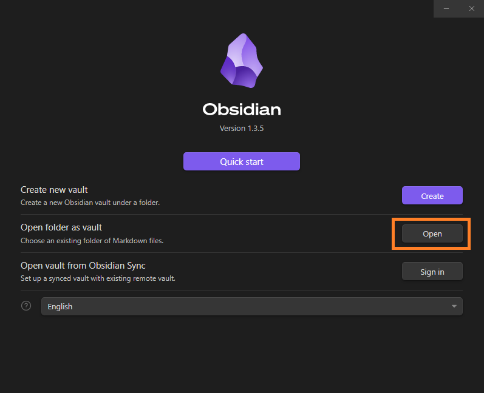
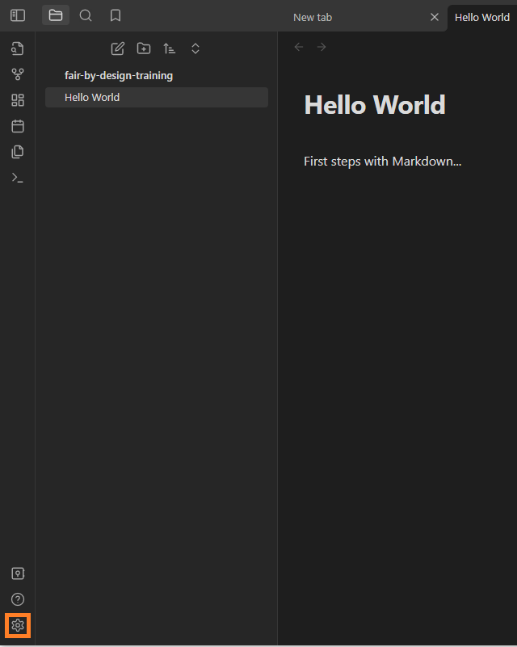
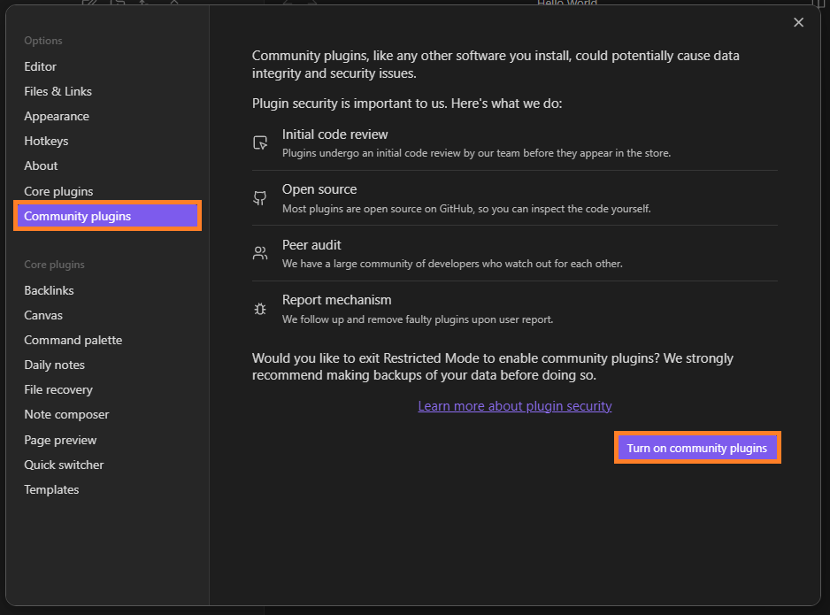
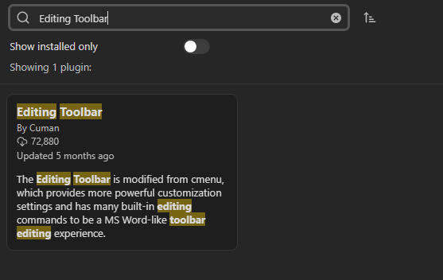
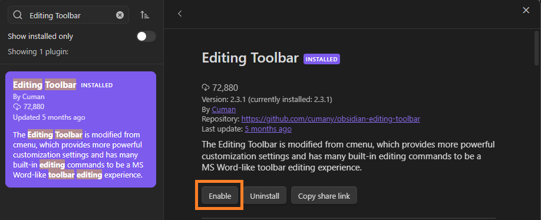
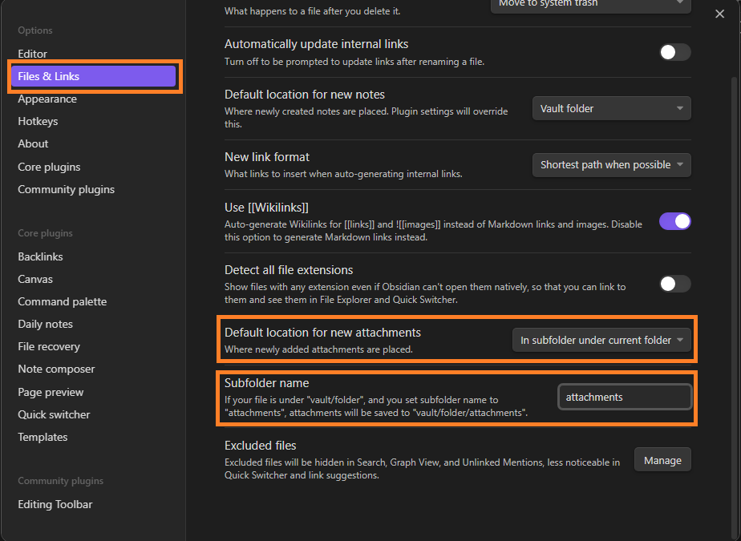
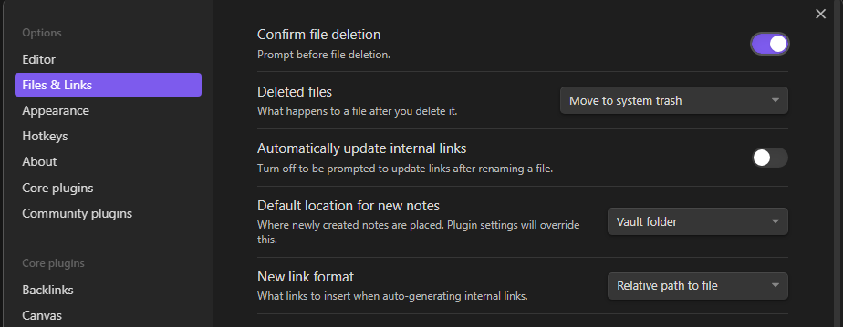
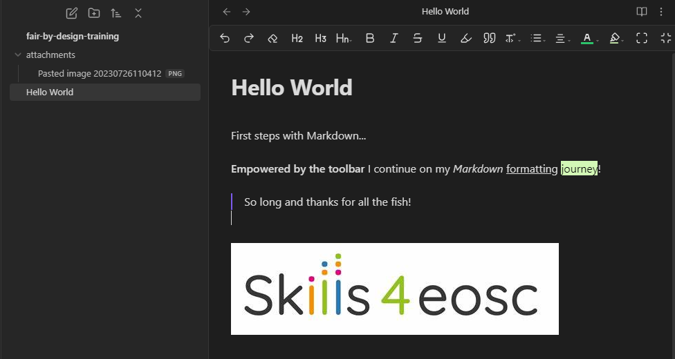

# Setting up a Markdown Editor

When talking about Markdown editors, the definition for what software can be seen as a Markdown compatible editor can be very broad. Since Markdown at its core is simply a text format, any editor that is capable of working with plain text files can in fact also be used for writing Markdown. Despite this, it would be helpful if the chosen software also introduces some quality-of-life improvements, which might make the process of writing in this format easier. The required features might vary from person to person, but we can generally accept that the editor should offer a WYSIWYG editing mode for inexperienced Markdown writers, as well as some sort of a live preview of the written content, showing how the content might appear once rendered to a final output format. 

## Introduction to Obsidian

In this training we will be using the [Obsidian](https://obsidian.md/) editor for writing all of the Markdown files throughout the different modules. Obsidian is a free-to-use cross-platform software which is simple to use and can be significantly extended through the use of community plugins, thanks to its modular architecture. We will be using some of those community plugins later in the exercise to augment the default out-of-the-box functionality. Experienced Markdown writers are more than welcome to continue using their editor of choice and follow along from the comfort of their existing writing environment. 

Obsidian offers a live preview for all written content and has a built-in search mechanism that can be used for quickly searching across all files placed in the current working repository. Opening a folder in Obsidian transforms it to a so called **vault**, but for our purposes this will be transparent since vaults can be created both from scratch as well as using an existing folder hierarchy.

## Exercise: Setting up Obsidian for Working with Markdown Files

The goal of this exercise is to configure Obsidian to work with the cloned repository, paying attention to required plugins, configuration options, and specific features.

1. Obsidian should already be installed on your workstation as part of the preparation process for the training. Make sure to launch it and select `Open folder as vault` option from the quick start wizard.

    

2. Navigate to the folder where you have cloned the forked repository in the previous exercise. 
3. Once the vault is opened, on the left hand side of the screen you will be presented with a navigation tree, while the right hand side will be reserved for file editing and live preview.

    

4. By default Obsidian is in the live preview mode, meaning that anything you write will be automatically shown in its rendered form once you move the cursor to the next line. Only the line which is currently being edited is shown in its raw Markdown form. To change this behavior you can use the book icon at the very top right edge of the screen, also pointed out in the picture below. We will discuss more about the Markdown syntax and be able to see what the different preview modes enable later in the training.

    

5. At first glance it seems that Obsidian does not offer a WYSIWYG editing experience, since there is no editing toolbox to be seen. While this is certainly true, the problem can be solved by installing a community plugin, which would enable point-and-click buttons for the most common Markdown formatting actions such as: headings, bullets, quotes, coloring... Plugins can be installed by navigating to the settings pane using the cog icon in the bottom left corner.

    

6. Once in the settings wizard, navigate to the `Community plugins` section and confirm the `Turn on community plugins` choice.

    

7. Click on the `Browse` button and search for the `Editing Toolbar` plugin by `Cuman`.

    

8. Confirm the installation of the plugin by clicking on the card and selecting `Install`. Once installed, `Enable` the plugin.

    

9. Close all open settings windows and return to the editor preview mode. You should be greeted by a brand new toolbar at the top of the screen, similar to what is available in popular text processors. 

    

10. Before moving forward, it would be beneficial to configure Obsidian to follow the recommended file hierarchy when working with attachments. The forked template repository assumes that all images will be stored in an attachments folder created at the same location where the Markdown files is stored. Obsidian supports automatic export of copy/pasted images, but we need to perform an extra step as to configure it to respect this file hierarchy. To do so, reopen the Obsidian settings window by using the cog icon in the bottom left hand corner.
11. Choose the `Files & Links` menu and set `Default location for new attachments` to `In subfolder under current folder`. Enter `attachments` in the `Subfolder name` input field.

    

12. To be compliant with the base Markdown specification, make sure to also set the `New link format` option to `Relative path to file` on the same settings page.

    

13. To test the new configuration you can go ahead and copy an arbitrary image and directly paste it into a Markdown document open on Obsidian. The image should automatically appear in the preview, and a newly created `attachments` folder will also be present in the navigation tree on the left sde.

    