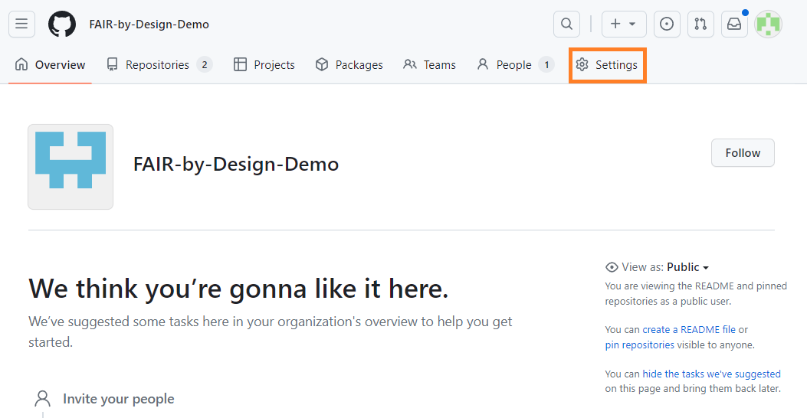
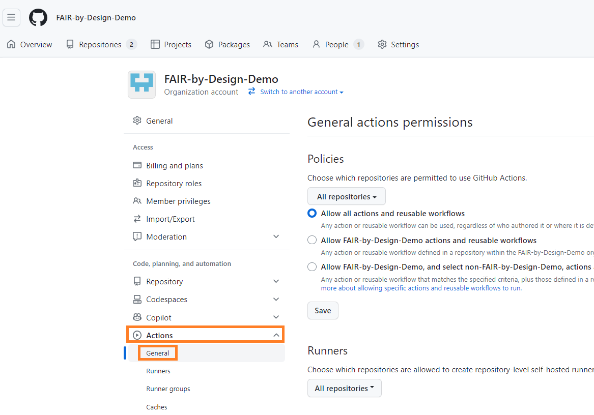
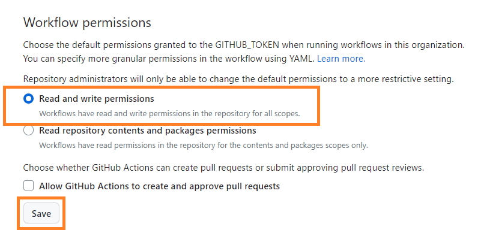
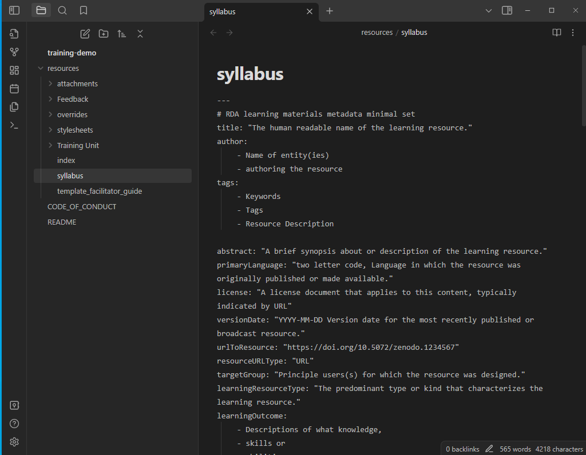
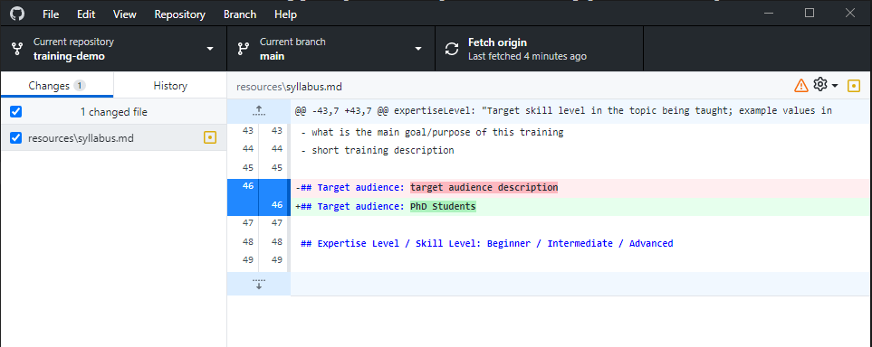
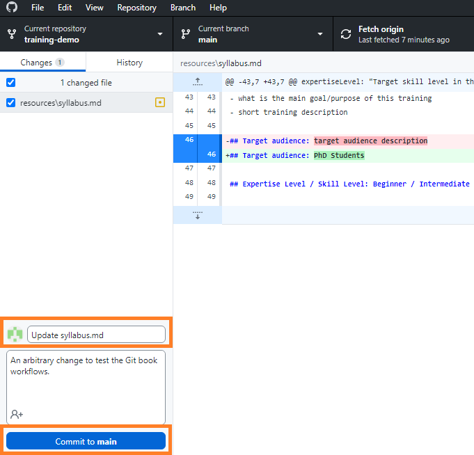
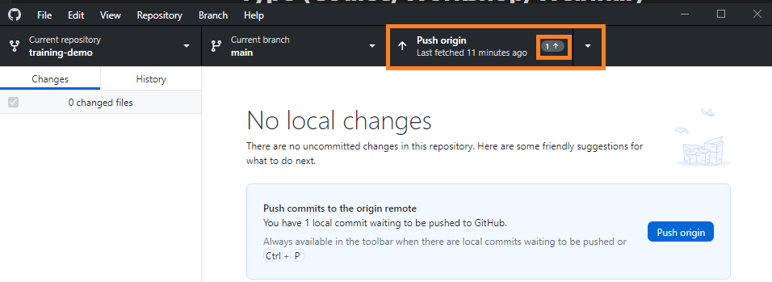
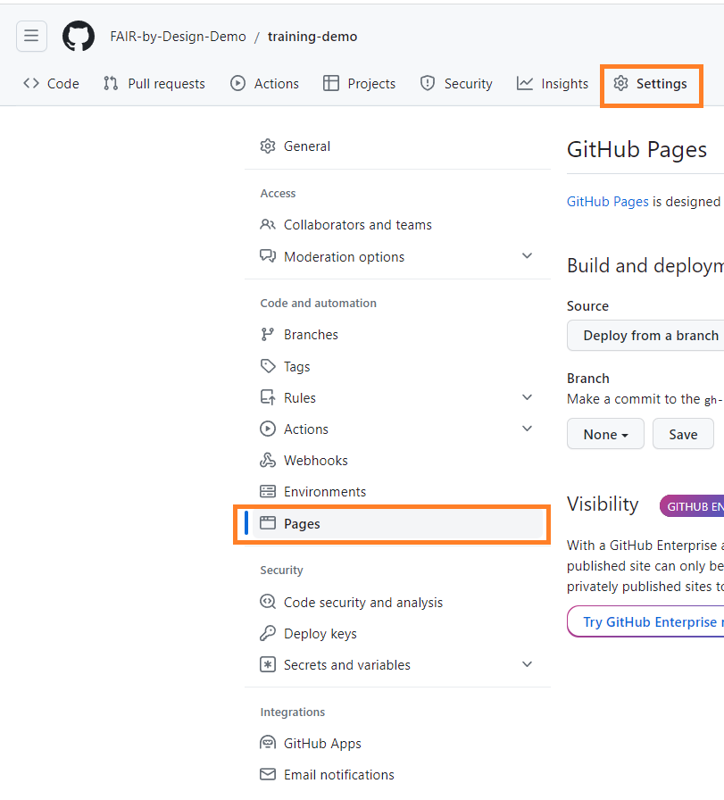
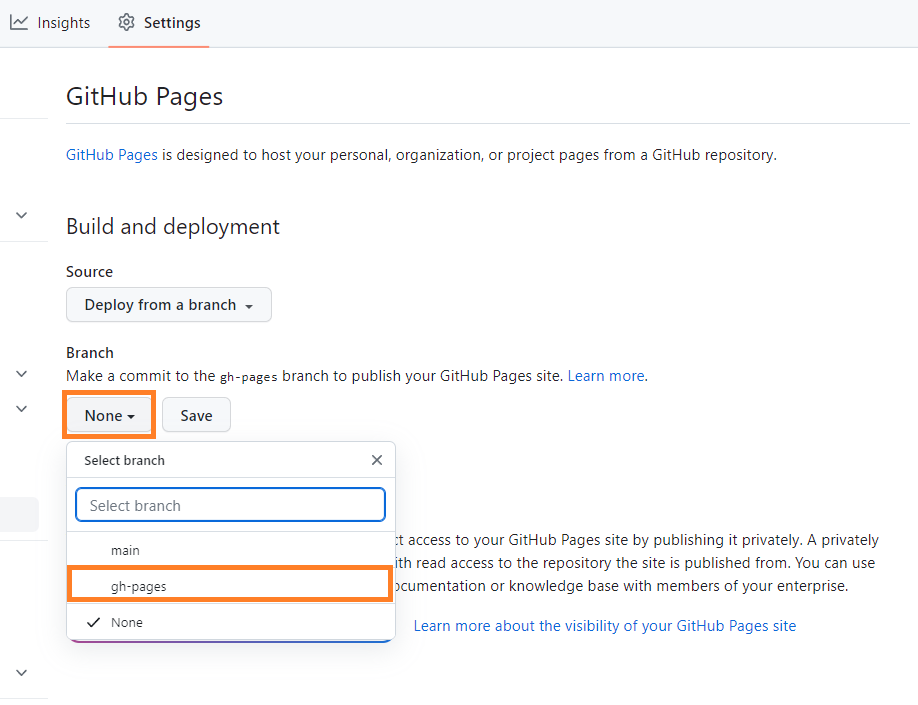
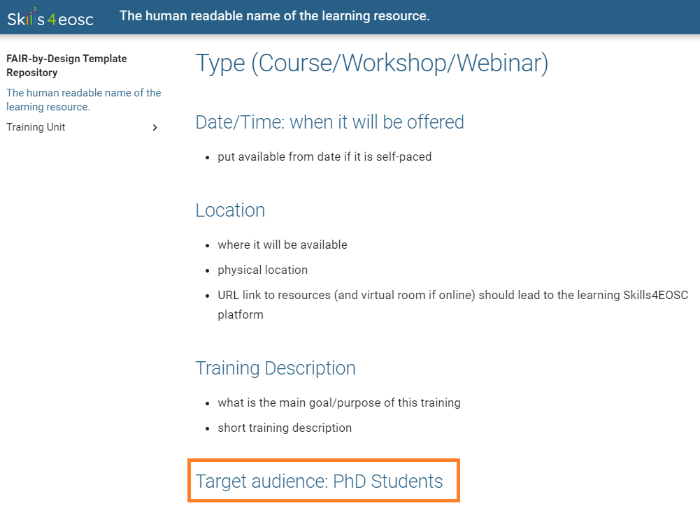

The production of a Git book would allow all of the written Markdown documents to be automatically converted to a more visually appealing HTML representation that could be viewed using a web browser. Additionally, existing Git book frameworks today are capable of producing complete websites, following a navigation strategy designed by the authors themselves. We will have a look at a popular Git book framework called [MkDocs](https://www.mkdocs.org/) and we will show the necessary steps to configure it, below.

The main goal would be to achieve a "set it and forget it" scenario, where once set up, MkDocs will not require any additional interaction or reconfiguration during the remaining stages of the FAIR-by-Design methodology. All new Markdown files should automatically be converted to an HTML representation and be visible in the rendered Git book.

To make the process of initial set up easier, the already forked `templates` repository [at the beginning of this unit](./09-Introduction%20to%20Markdown%20and%20Git.md) can be reused, instead of setting up everything from scratch. In the exercise that we will make the necessary adjustments to the forked repository, create an example page, and push our very content to the Git book.

## Exercise: Setting up a Git book with MkDocs

As part of this exercise we will be working on the already forked template repository [FAIR-by-Design-Methodology/templates](https://github.com/FAIR-by-Design-Methodology/templates), reusing its content. As a reminder, the process of `forking` an existing repository results in the creation of a new repository which is an identical copy of the original, and the owner is the user/organization who initiated the fork. Since at this point we already forked the repository in [Introduction to Markdown and Git](./09-Introduction%20to%20Markdown%20and%20Git.md), we will only change the GitHub settings for the new repository to allow for automatic building of the MkDocs Git book. Finally we will edit some of the existing Markdown files so that the first version of our Git book can be built.

### Step 1: Making the Necessary Changes to the Repository's Configuration

 1. Navigate to [GitHub](https://github.com) and open the fork created previously. The page at this point should look similar to the picture below. Note that some of the files might differ, depending on when you are following this guide.

    

 2. The first configuration step is to allow the existing workflows which were defined in the template repository to run in the forked one as well. Workflows are automated scripts written as a sequence of steps which need to be executed upon a certain event (e.g., file modification). The template repository, and as a result any forked repositories, heavily rely on such workflows to automate the continuous updating of the Git book, but also to facilitate easy publishing on Zenodo, discussed in more details in the next Stage. The workflows are generic and do not require extensive manual modification before they can be applied to forked repositories as well. Note that workflows are run only when the content is `pushed` to GitHub, and do not execute on local changes made to the locally cloned repository.

    To enable the workflows, click on the Actions tab and then choose `I understand my workflows, go ahead and enable them`.

    

3. Once enabled, we need to allow the workflows to make automated changes to files present in the repository. This is needed so that the workflows can automatically update the Git book with information such as the license, attribution, and metadata. By default workflow scripts are only allowed read only access to the repository content.

    Navigate to your organization's landing page. Note that this page is different than the repository landing page. One way of opening the organization's page is by clicking on the profile picture on the top right hand corner, selecting `Your organizations` and then choosing the organization's name from the list. From the landing page, choose `Settings`

    

4. Select `Actions -> General` from the left hand navigation menu.

    

5. Scroll down until the section titled `Workflow permissions` becomes visible and click on the `Read and write permissions` options, before saving the changes using the `Save` button.

    

6. The change that we just made was at the GitHub Organization level. It was required so that individual repositories within the organization could also enable `Read and write permissions` for workflows. The next step is to verify that the extra permissions have been assigned to the forked repository as well.

    Navigate to the repository Settings page (reminder that these Settings are independent from the Organization settings that we just altered), choose `Actions -> General`, scroll down until the `Workflow permissions` section appears, and verify that `Read and Write Permissions` is selected. If it is not selected, select it and save the changes.

### Step 2: Making Local Changes to the Repository

To test the Git book functionality, let's edit some of the existing content in the syllabus template available in `resources/syllabus.md` and verify that it will be rendered to HTML and made publicly accessibly from any web browser on the planet.

 1. Open the GitHub Desktop client and verify that all of the commits from the upstream repo are downloaded locally by clicking on the `Fetch origin` button.

    

2. Open Obsidian.

    

3. Using the left hand file tree open the `syllabus` file in the `resources` directory.
4. Make an arbitrary change to its content, e.g. change the `Target audience`.

    

5. Switch back to GitHub Desktop and verify that the change has been registered.

    

    The above picture shows one of the great advantages of Markdown, the ability to have a detailed representation of what has been changed in each of the files. Lines that have been removed are shown in red with a `-` prefix, while lines that have been added are shown in green with a `+` prefix.

6. We can commit the changes so that they are part of the official history of the repository by adding a commit title and an optional description.

    

7. Local commits are not automatically pushed to GitHub. To do so, we have to explicitly select the `Push origin` button that should also show a small icon with an arrow at this point, signalling that there is one local commit which has not been uploaded.

    

8. Once the changes are pushed to GitHub, the corresponding workflow script for building the Git book will be triggered. You can verify this by going to the landing page of the repository on GitHub and checking the workflow status.

    

    While the workflow is in progress there will be a small brown button next to the unique commit identifier (`4719aa1` in the picture above).

    

    Should the workflow complete successfully, the brown dot will be changed to a green checkmark as shown in the picture above. If an error is encountered during the workflow's execution, a red cross will be shown.

### Step 3: Enabling Free Hosting of the Git book on GitHub

Since this is the first time that the Git book has been rendered using one of the automatic workflows, we need to enable free website hosting provided by GitHub. This action needs to be performed only once. Any subsequent changes to the markdown files can simply be committed and pushed, after which they will appear "automatically" on the live website.

1. Go to the repository settings by clicking on the `Settings` button and navigate to the `Pages` section.

    

2. In the `Branch` section, click on the dropdown menu and select `gh-pages`.

    

     Once `gh-pages` has been selected, another field will appear that will be pre-populated with the option `/ (root)`. Leave that field as is. Save the changes using the `Save` button.

    

3. Wait a couple of moments and refresh the page. A new section titled `Your site is live at...` should be visible at the top.

    

    The URL is generated automatically based on the GitHub organization name and the repository title.
    
4. Clicking on the URL should open the Git book in your web browser. The change made in the previous steps should also be visible.

    

Any future changes, after being committed and pushed to GitHub using the GitHub Desktop client will automatically be shown on the live web page. In the next exercises we will systematically edit each Markdown template one by one, and preview our changes in the same way as we did now.

## Key Takeaways

At this point we have a functional environment which we can use to practice the FAIR-by-Design methodology. We set up the required tools (Obsidian and GitHub Desktop), got introduced to GitHub and Markdown, and created our very own Git book. We also tackled the difference between the various intermediate and final output formats, giving recommendations on which ones to choose.

We will use these newly obtained skills in the sections that follow, gradually building our FAIR-by-Design course, starting with the development of a Unit Plan.