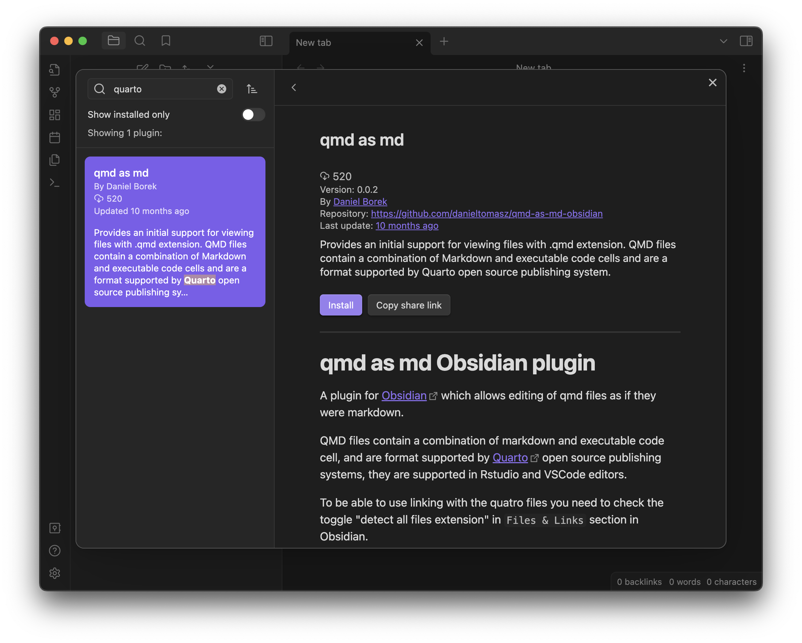
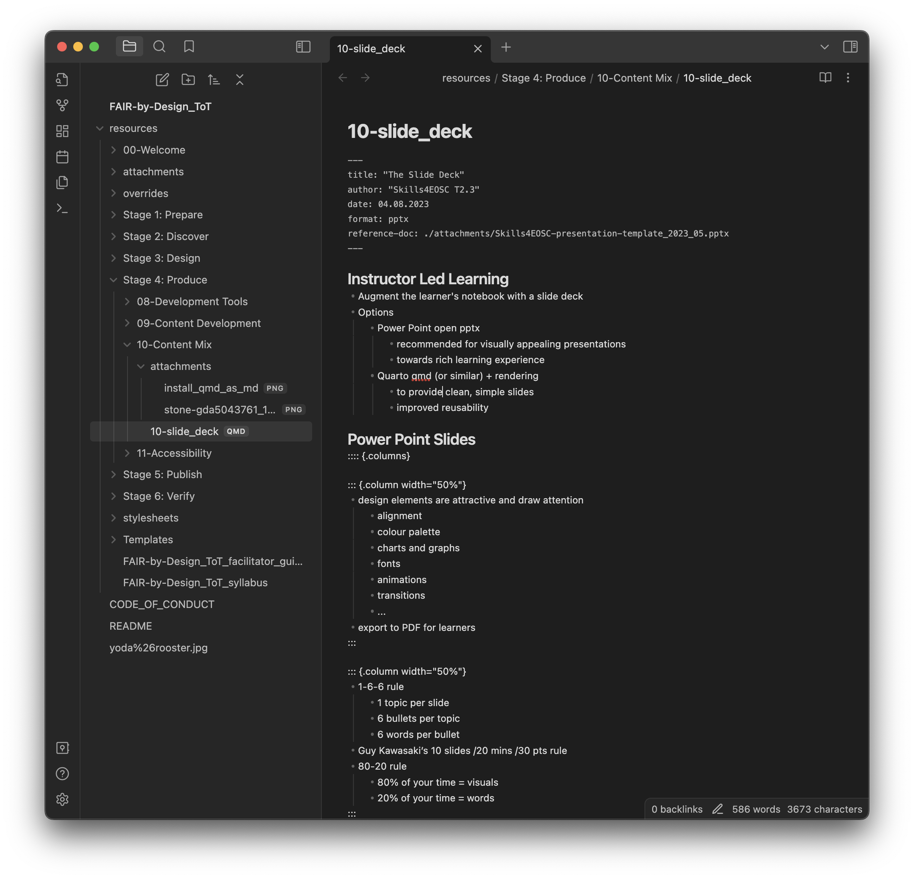

# The Slide Deck

For instructor led learning environment a slide deck is used as an additional supporting learning material that helps support the training process and provides visual cues for the learners. The slide deck should be prepared in an open format so that it is reusable by other trainers. It is best if it is shared with the learners in a PDF format to ensure correct layout when opened with a variety of tools on different platforms.

## Learning Objectives
- Extend the learning content
- Define slides in open format

## Target Audience
- attendees of the FAIR-by-Design ToT live webinar

## Duration
20 mins

## Prerequisites
Completed [Stage 3: Design](../../Stage%203:%20Design/)
Completed [09-Content Development](../09-Content%20Development/)

## Learning Tools
- Training BBB room
- optional: Obsidian & Quarto

## Using a slide deck

When developing learning content for self-paced online courses, the HTML content that is obtained from the markdown based learning notebook should be sufficient when combined with all of its attached multimedia.

In an instructor led environment where trainers get in touch with the trainees and support their learning process by transferring their knowledge and experience in a physical workshop or online webinar, the learner notebook becomes a supporting material for reference and the main learning content is usually presented in a form of a slide deck further supported with activities and other props.

For these types of scenarios the learning materials being developed should include a slide deck per learning unit.

## Preparing a slide deck

The slide deck should be prepared in an open file format to support its reuse by other trainers and instructors. There are a number of options that can be used to create the slide deck in an open format. Here we will briefly cover two options that represent two different approaches to creating a slide deck:

1. Using Power Point and its open pptx format
	- this is a popular representative of the category of tools that enable the creation of highly visually appealing slide decks with lots of advanced features such as smart arts, animations, graphics, etc.
2. Using Quarto and its qmd format that can then be rendered in another format (pptx in our case)
	- this is a popular representative of the category of tools that aim for simple, clean slides focusing on the content, not on its visual appeal
	- this means that if you choose this option and still want visually appealing slides you will then need to put in a lot of additional effort into redesigning the rendered content obtained from the qmd, which makes this choice too complicated and time consuming at the moment.

Given that we already covered the importance of rich learning experience and the role that visually appealing learning material plays in the creation of this rich learning experience, we recommend the use of the first option. As it can be seen in the learning materials for this training, we have followed the first option for all lessons, except for this one, where we wanted to show how the slide deck would look like if option no. 2 is chosen. However, it must be stated that the tools belonging to option no. 2 are becoming very popular lately and are rapidly advancing in terms of support for more complex layouts and multimedia integration.

Please note, that the use of Google Slides at the moment does not imply using open file format, as their native format of storing the slide deck is not yet open. 

## Power Point Presentations

The main reason for using Power Point - like applications for generating the slide deck is their ability to create slides that include very attractive designs and draw the attention of the learner. For these purposes one can use a large set of different features such as:

- fine alignment of different elements on the slide
- carefully chosen color palette
- special slide layouts and designs
- charts, graphs, smart arts
- integrated multimedia
- different fonts and styles
- custom animations
- slide transitions
- etc.

When using Power Point for the Skills4EOSC trainings, you should 

1. start from the Skills4EOSC template 
2. use the [Learning_unit_content template](https://github.com/FAIR-by-Design-Methodology/templates/blob/main/resources/Learning%20Unit/Learning_unit_content.pptx) to guide you regarding the set and order of slides that the training should have
	- this template has been developed based on the HUNTER model discussed in [Stage 3: Design](../../Stage%203:%20Design/06-Learning%20unit%20development/06-LearningUnitDevelopment.md)

As there is a separate Skills4EOSC training on how to design effective slides, here we will provide just a few tips and tricks on the aspects of Power Point slides design:

1. Follow the [1-6-6 rule](https://www.presentationtraininginstitute.com/the-6-by-6-rule-for-presentations-explained/)
	- there should be only 1 topic per slide
	- use max 6 bullets per topic
	- use max 6 words per bullet
	- note that this rule comes in many varieties were the number 6 is changed to 5 or 7
2. Implement the [Guy Kawasaki 10-20-30 rule](https://blog.hubspot.com/blog/tabid/6307/bid/1056/steve-jobs-guy-kawasaki-powerpoint-best-practices.aspx#:~:text=The%2010%2F20%2F30%20rule%20of%20PowerPoint%20is%20a%20straightforward,to%20create%20excellent%20PowerPoint%20presentations.)
	- your presentation should have max 10 slides per topic
	- you should not need more than 20 mins per topic
	- you should use min 30 pts font size
3. Use the [80-20 rule](https://ethos3.com/how-to-apply-the-80-20-rule-to-your-presentation/#:~:text=It%20might%20make%20sense%20to,your%20time%20on%20your%20words.)
	- spend 80% of your time on the visuals of the slide
	- spend 20% of your time on the words on the slide

It is recommended that the final slide deck is shared with the learners in a PDF format ensuring that the layout of the slide will not be changed. 

## Quarto Presentations

Quarto is an open-source scientific and technical publishing system that enables the user to write the content in markdown and add dynamic content using Python, R, Julia or Observable. 

The created QMD document can then be published as an article, presentation, website, blog, or book in many different formats.
For the purposes of this learning unit we will be looking into how to use Quarto with Obsidian to publish the content of the QMD document as a pptx file. 

### Getting started with Quarto

To work with Quarto you first need to install it. Choose [Get Started](https://quarto.org/docs/get-started/) on its [homepage](https://quarto.org/). Install Quarto for your platform.

Obsidian does not offer an official plugin to work with Quarto, but there is a community developed plugin that can be used for these purposes. To be able to work with the Quarto QMD files in Obsidian you need to do the following steps:

1. enable community plugins in Obsidian
	- go to settings -> community plugins and choose "Turn on community plugins"
2. while in community plugins, go to browse and type "quarto" in the search box
3. choose the "qmd as md" plugin and install it
4. enable the "qmd as md" plugin

You are now able to work with qmd files in Obsidian.

To create a qmd slide deck, you can start from the [template_quarto.qmd](https://github.com/FAIR-by-Design-Methodology/templates/blob/main/resources/Learning%20Unit/template_quarto.qmd) that is available in the templates GitHub repository. Copy the file in the learning unit folder where you want to develop your slide deck and then start editing it. The template provides a number of examples of different basic slide layouts that you can use.

### Creating a slide deck with Quarto

To create the **title slide** for the presentation you need to provide information in the QMD file header. The Quarto rendered will use this information to autogenerate the title slide. The min information that needs to be provided in the header is:

- **title** - this is the title of the presentation
- **author** - the author of the presentation
- **date** - date the presentation was created or last modified
- **format: pptx** - tells the renderer that the output should be a Power Point presentation file
- optional **reference-doc: location_and_name_of_template_presentation.pptx** - tells the renderer that the provided pptx file should be used as a template for the slides layout.

Note that if you use the Skills4EOSC presentation template, only the basic slide layout template is recognised and used, for the other layouts such as title slide, section slide, two content slide, blank slide, etc. the renderer reverts back to default settings and the resulting slide layout is not very usable.

The rest of the slides in the slide deck are created based on the following rules:

- heading 1 - # - is used to mark the title of a section slide
- heading 2 - ## - is used to mark the title of a regular slide
	- the content of the slide is what comes after the heading

The **basic slide content** can be:

- simple text - just type the text under the heading 2 title
- bullets list - use the regular MD notation for bullets
- numbered list - use the regular MD notation for numbered bullets
- image - use the regular MD notation for adding an image
	- note that the alt text for the image will appear as image caption in the pptx file
	- use the alt text to write the attribution, if needed
- table - use the regular MD notation for adding a table

If you want to add **speaker notes** to the slide then you need to provide the text for the speaker notes between a specific set of commands (staring and ending with 3 colons - :::) after a blank line at the end of the slide content definition as:

	::: {.notes}
	this is an example for speaker notes
	:::

To define the layout of a slide with **two contents** you need to use the columns command:

	:::: {.columns}

	:::{.column width=40%}
	- this is the content of left column
	:::

	:::{.column width=60%}
	- this is the content of right column
	:::

	::::

The content of each of the columns can be text, bullets, image, table, etc. 

An example content of a qmd file is presented in the image below.

### Render

Once the slide content is defined, the installed Quarto engine needs to be used to render it into the defined format, in this case pptx.

To do this you need to

1. open a terminal
2. navigate to the folder where you have the qmd file
3. run the command "quarto render FILENAME.qmd"

There will be output that you can follow to see if Quarto managed to successfully render the slides.

The created pptx file will be located in the same folder as the source qmd file. 

For more information on how to make Power Point presentations using Quarto, refer to the [online user guide](https://quarto.org/docs/presentations/).

## Summary

The slide deck is an important tool for instructor led learning. Its content should enrich the learning experience of the learners that follow the training. 

To improve reuse use an open file format for the slide deck such as Power Point pptx, Quarto qmd or similar. 

The structure of the slide deck should follow the HUNTER model.

## Suggested Reading
- [Blog of the Presentation Training Institute](https://www.presentationtraininginstitute.com/blog/)
- [Quarto Guide - Presentations](https://quarto.org/docs/presentations/)
- [Marp - Markdown Presentation Ecosystem](https://marp.app/)